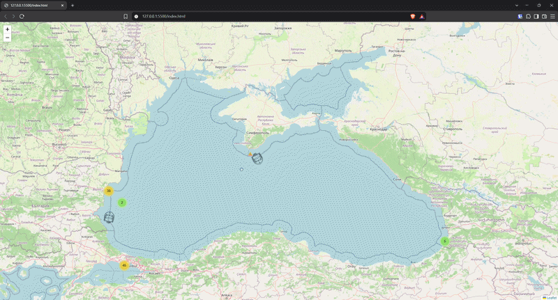

# BlackSeaAIS



## Descriere

O aplicație C# care se conectează la stream-ul AIS de la aisstream.io, urmărește nave din Marea Neagră în timp real, și salvează pozițiile lor curente + istoricul de mișcare într-o bază de date Postgres. Include și o hartă interactivă live, care afișează navele pe hartă direct din browser. Pozițiile primite sunt validate geografic pentru a detecta GPS spoofing.

## Tehnologii

**Backend**

- C# / .NET
- Npgsql
- WebSocket
- NetTopologySuit

**Bază de date**

- Postgres / Supabase
  **Frontend**

- Leaflet.js (hartă interactivă)
- Leaflet.markercluster (grupare vizuală a navelor apropiate)
- Supabase JS (citire live a datelor din browser)

## Structura proiectului

| Fișier / Folder           | Rol                                                              |
| ------------------------- | ---------------------------------------------------------------- |
| `Program.cs`              | Se ocupă cu conectarea și bucla de reconectare                   |
| `AiStreamClient.cs`       | Conectare WebSocket, subscribe, primire mesaje AIS               |
| `DatabaseService.cs`      | Upsert în `ships` și insert în `position_history`                |
| `GeoValidationService.cs` | Validează dacă o poziție cade pe uscat (posibil GPS spoofing)    |
| `AisModels.cs`            | Clasele care oglindesc structura mesajelor JSON primite          |
| `Data/`                   | Fișierul GeoJSON cu contur de uscat (sursă: Natural Earth)       |
| `index.html`              | Harta live cu navele, citită direct din Supabase                 |
| `css/`, `js/`             | Bibliotecile Leaflet și Supabase, folosite local de `index.html` |

## Rulare — Backend

### 1. Cheie API aisstream.io

Creează un cont gratuit pe [aisstream.io](https://aisstream.io) și generează o cheie API.

### 2. Bază de date Postgres

Creează un proiect propriu pe [Supabase](https://supabase.com) (sau folosește orice instanță Postgres). Rulează SQL-ul din secțiunea **Structura bazei de date** de mai jos, ca să creezi tabelele necesare, înainte de prima rulare.

### 3. Row Level Security (RLS)

Tabelul `ships` trebuie să aibă o policy de citire publică, altfel harta din `index.html` nu va primi date (Supabase întoarce un răspuns gol, fără eroare explicită, dacă RLS e activ dar nu există nicio policy).

În Supabase, mergi la **Authentication → Policies → ships → Create policy**, și creează o policy:

- **Command**: `SELECT`
- **Target roles**: implicit (toate rolurile publice)
- **USING expression**: `true`
  Repetă aceeași policy și pentru tabelul `position_history`, altfel traseele navelor nu vor fi vizibile în hartă.

### 4. Variabile de mediu

Creează un fișier `.env` în rădăcina proiectului, cu următoarele variabile:

| Variabilă           | Descriere                             |
| ------------------- | ------------------------------------- |
| `AISSTREAM_API_KEY` | Cheia API obținută de pe aisstream.io |
| `PASSWORD`          | Parola bazei tale de date Supabase    |

### 5. Rulare aplicație

```bash
dotnet run
```

## Rulare — Frontend (harta live)

`index.html` citește direct din Supabase, folosind cheia publică `anon`.

1. Deschide `index.html` cu un server local (ex. extensia **Live Server** din VS Code).
2. Dacă folosești propriul tău proiect Supabase, înlocuiește URL-ul și cheia `anon` din `index.html` cu ale tale (Supabase Dashboard → Settings → API).
   Harta se actualizează automat la fiecare 5 secunde, arătând ultima poziție cunoscută a fiecărei nave. Traseul unei nave (buton "Vezi traseu" din popup) exclude automat pozițiile marcate ca implauzibile.

## Structura bazei de date

### Tabelul `ships`

Ține **ultima poziție cunoscută** pentru fiecare navă (upsert pe MMSI).

```sql
CREATE TABLE IF NOT EXISTS ships (
    mmsi BIGINT PRIMARY KEY,
    ship_name TEXT,
    last_latitude DOUBLE PRECISION,
    last_longitude DOUBLE PRECISION,
    sog DOUBLE PRECISION,
    cog DOUBLE PRECISION,
    true_heading INTEGER,
    navigational_status INTEGER,
    last_update TIMESTAMPTZ,
    is_plausible BOOLEAN DEFAULT TRUE
);
```

### Tabelul `position_history`

Ține **istoricul complet** de poziții per navă (un rând nou pentru fiecare mesaj primit).

```sql
CREATE TABLE IF NOT EXISTS position_history (
    id SERIAL PRIMARY KEY,
    mmsi BIGINT,
    latitude DOUBLE PRECISION,
    longitude DOUBLE PRECISION,
    recorded_time TIMESTAMPTZ,
    is_plausible BOOLEAN DEFAULT TRUE,
    FOREIGN KEY (mmsi) REFERENCES ships(mmsi)
);
```

`is_plausible` indică dacă poziția a trecut validarea geografică (vezi secțiunea **GPS Spoofing Detection** mai jos). Datele nu sunt niciodată respinse la insert — toate pozițiile sunt salvate, doar marcate, pentru a păstra istoricul complet disponibil pentru analiză.

## GPS Spoofing Detection

Zona Mării Negre, este cunoscută pentru spoofing GPS pe scară largă.Reprezintă navele care raportează prin AIS poziții care nu corespund locației lor reale, adesea plasându-le pe uscat în loc de mare.

Pentru a filtra acest fenomen, aplicația validează fiecare poziție primită împotriva unei geometrii land/sea (sursă: [Natural Earth](https://www.naturalearthdata.com/), rezoluție 1:50m), folosind [NetTopologySuite](https://github.com/NetTopologySuite/NetTopologySuite). Pozițiile care cad pe uscat sunt marcate `is_plausible = false`.

**Detalii tehnice:** un punct este considerat pe uscat doar dacă se află **în interiorul** unui poligon de uscat, la o distanță de graniță mai mare decât un prag mic (~200m). Condiția combinată (interior + distanță minimă de graniță) reduce fals-pozitivele cauzate de simplificarea coastline-ului la rezoluție 1:50m, păstrând totuși detecția corectă pentru poziții clar eronate.

## Funcționalități

- Conectare live la stream-ul AIS, filtrat pe o zonă geografică (bounding box) din Marea Neagră
- Deserializare a mesajelor AIS în obiecte C# tipizate
- Upsert automat al ultimei poziții per navă
- Salvare a istoricului complet de mișcare
- Validare geografică a pozițiilor pentru detectarea GPS spoofing
- Reconectare automată la WebSocket în caz de întrerupere a conexiunii
- Gestionare a erorilor de deserializare și de bază de date, fără oprirea programului
- Hartă interactivă live, cu grupare vizuală (clustering) a navelor apropiate
- Rotația iconiței fiecărei nave în funcție de direcția reală de mișcare (true heading)
- Afișare a traseului istoric al unei nave, la cerere (excluzând pozițiile implauzibile)
- Avertisment vizual pentru navele cu poziții suspecte
- Actualizare automată a hărții la fiecare 5 secunde
